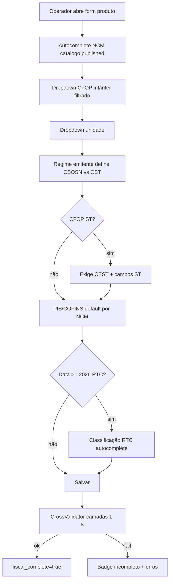

# EXEQ Hub — Estudo Técnico: Reforma Tributária, NF-e 55, NFC-e 65 e Fidelidade Fiscal-Contábil

| Campo | Valor |
|-------|--------|
| Versão | **1.0.0** |
| Data | 2026-09-06 |
| Autor | Tech Lead (fábrica EXEQ Hub) |
| Status | **Estudo técnico autorizável PO** — orienta desenvolvimento; **não substitui ADR** nem amend DER sem aprovação |
| Hierarquia | Contrato → v1 → v2 → v3.1 → ADR/LLR → **este estudo** → implementação |
| Relacionados | `Exeq_Hub_Reforma_Tributaria_RTC_MultiDocumento_Estudo_Tecnico.md` (0.1.0-draft) · `ADR_RTC_001` · `ADR_NFE_001` · `Exeq_Hub_LLR_NFe_Dominio_SEFAZ_Greenfield.md` · `Exeq_Hub_LLR_NFCE_Emissao_PDV_Kickoff.md` |
| Público | PO, Tech Lead, engenharia backend/frontend, QA fiscal, contador parceiro |

---

## 0. Propósito e resultado esperado

Este documento consolida **o que desenvolver** para que o EXEQ Hub seja **fidedigno** em:

1. **Emissão** NF-e (mod 55) e NFC-e (mod 65) perante SEFAZ (XML, rejeições, artefatos).
2. **Dados fiscais** por item e por documento (ICMS, PIS/COFINS, IPI, ST, IBS/CBS/IS).
3. **Dados contábeis** deriváveis do XML/snapshot (natureza, CFOP, bases, impostos, totais, trilha de auditoria).

**Princípio rector:** o documento fiscal autorizado é a **fonte de verdade** pós-emissão; cadastros e catálogos alimentam o **snapshot imutável** no submit (LLR NF-e D-07, RF-30–34).

**Honestidade técnica:** conformidade “absoluta” depende de NTs e tabelas que evoluem (NT 2025.002-RTC já passou por dezenas de revisões). O Hub deve implementar **governança de versão + testes golden**, não enums congelados em código.

---

## 1. Escopo do programa

### 1.1 Dentro do escopo

| Épico | Conteúdo |
|-------|----------|
| **CAT** | Catálogos versionados NCM, CFOP, CEST, unidades, CST (ICMS/PIS/COFINS/IPI) |
| **VAL** | Motor de validação cruzada NCM × CFOP × CST × regime × operação |
| **NFE-G** | Evolução NF-e 55: produto fiscal completo, motor ampliado, XML RTC |
| **NFCE-G** | Consolidação NFC-e 65: RTC via tabelas oficiais, alinhamento pagamento/vNFTot |
| **RTC-G** | Reuso `apps/fiscal/` (pilares ADR-RTC-001) para **mercadorias** |
| **ACC** | Pacote mínimo contábil: snapshot forense, export XML, metadados apuração |
| **GOV** | Ritual normativo, import, publish/supersede, feature flags |

### 1.2 Fora do escopo (explícito nesta fase)

- Split payment bancário (LC 214 / Ato Conjunto RFB-CGIBS).
- Portal contador completo (UI escritório).
- CT-e, MDF-e, manifesto destinatário.
- Apuração contábil automática (EFD gerada no Hub) — Hub **emite e audita**; ERP/contador **apura**.
- Estoque, WMS, pedido→nota.

### 1.3 Documentos normativos a versionar (cofre conformidade)

| ID | Fonte | Uso |
|----|--------|-----|
| N-01 | Manual Orientação Contribuinte NF-e 4.00 | FSM, eventos, rejeições |
| N-02 | NT **2025.002-RTC** (Portal NF-e) | Grupo UB, W03, layout pl009 |
| N-03 | Tabelas CST / cClassTrib / cIndOp / cCredPres | Classificação reforma |
| N-04 | TIPI / tabela NCM Receita | NCM, IPI |
| N-05 | Tabela CFOP CONFAZ | Natureza operação |
| N-06 | CEST / convênios ICMS ST | Substituição tributária |
| N-07 | LC **214/2025**, EC 132/2023, ADCT | Cronograma transição |
| N-08 | Ajuste SINIEF CSOSN/CST ICMS | Simples vs Normal |

---

## 2. Estado atual do codebase (baseline 2026-09-06)

### 2.1 NF-e modelo 55 (`apps/nfe/`)

| Capacidade | Status |
|------------|--------|
| FSM draft→authorized, cancel, CCe, inutilização | Implementado |
| Adapter SEFAZ stub + HTTP (`integrations/sefaz_nfe/port.py`) | Implementado |
| Motor fiscal `goods-0.2.0-u5` | SN CSOSN102 + CST00 + PIS/COFINS básico |
| XML `xml_nfe.py` NFe 4.00 legado | Sem Grupo UB RTC |
| Catálogo RF-100 | Allowlist fixa ~20 NCM / ~8 CFOP em `catalog.py` |
| Produto `NfeProduct` | Campos planos; CFOP/unidade texto livre |
| RTC | `rtc_hooks_placeholder()` — ibs/cbs/is null |
| `dhEmi` | Fixo T12:00:00 (dívida técnica; NFC-e já corrigida) |

### 2.2 NFC-e modelo 65 (`apps/nfce/`)

| Capacidade | Status |
|------------|--------|
| FSM, PDV avulsa, stub/HTTP | Implementado |
| Motor + CSOSN SN | Implementado |
| RTC goods (`apps/nfce/rtc.py`) | Ano-teste 2026; rates hardcoded |
| XML Grupo UB (`xml_nfce_rtc.py`) | Parcial; `NFCE_RTC_MODE=shadow\|emit` |
| Classificação RTC | **Não** usa `RtcClassificationCode` — CST 000 fixo |
| DANFE cupom (`exeq-danfce-1.0`) | Implementado; dhEmi/dhRecbto corrigidos |
| Pagamento vs vNFTot | Verificar alinhamento `vPag` × total com IBS/CBS |

### 2.3 Reforma — bounded context compartilhado (`apps/fiscal/`)

| Pilar ADR-RTC-001 | NFS-e | NF-e/NFC-e goods |
|-------------------|-------|------------------|
| 1 Assessment IBS/CBS | `rtc_assessment.py` (serviços) | NFC-e BC item total; NF-e ausente |
| 2 Classificação | `RtcClassificationCode` | Seed mínimo; goods não consome |
| 3 Normativo | `RtcNormativeVersion` | Metadata only |
| 4 Forensic | `rtc_forensic.py` | NFC-e parcial; NF-e ausente |
| 5 Catálogo nacional ISS | `rtc_catalog_guard.py` | N/A goods |

### 2.4 Gap summary (bloqueio futuro)

| Gap | Severidade | Quando bloqueia |
|-----|------------|-----------------|
| Catálogo versionado goods | Alta | G-EMIT produção + sortimento real |
| Validação cruzada | Alta | Apuração / rejeições operacionais |
| RTC NF-e Grupo UB | Crítica | **03/08/2026** CRT=3 produção |
| RTC NFC-e tabelas oficiais | Alta | **04/01/2027** SN produção |
| ST / CEST | Condicional | CFOP 5403/5405 |
| IPI | Condicional | Indústria/importador |

---

## 3. Arquitetura alvo

### 3.1 Camadas (v2 — inalterado)

```
View (Hub V4 / Admin / API)
  → Serializer
    → Application Service (emit, validate, cancel)
      → Domain: TaxEngineGoods + CatalogResolver + CrossValidator + RtcGoodsAssessment
        → ORM (NfeProduct, NfeInvoice, NfceInvoice, GoodsCatalogVersion, …)
      → Integration: integrations/sefaz_nfe (xml, sign, port, danfe)
```

**Regra:** XML **sempre** montado a partir do `fiscal_snapshot` congelado — nunca na View.

### 3.2 Bounded contexts propostos

| Contexto | Módulo | Responsabilidade |
|----------|--------|------------------|
| **goods_catalog** | `apps/fiscal/goods_catalog/` (ou `apps/nfe/catalog/`) | Versões NCM/CFOP/CEST/unidade; import; publish |
| **goods_validation** | `apps/nfe/validation.py` | Matriz NCM×CFOP×CST; mensagens operador/fiscal |
| **goods_tax** | `apps/nfe/tax.py` + `apps/nfce/tax.py` | ICMS/PIS/COFINS/IPI/ST; delegação RTC |
| **rtc_goods** | `apps/fiscal/rtc_goods.py` | BC mercadoria, classificação, período 2026/2027+ |
| **rtc_xml** | `integrations/sefaz_nfe/xml_*_rtc.py` | Grupo UB, W03, IS |
| **fiscal_time** | `integrations/sefaz_nfe/fiscal_time.py` | dhEmi, dhRecbto, exibição local |

### 3.3 Unificação NF-e / NFC-e

| Concern | Estratégia |
|---------|------------|
| Port SEFAZ | `NfeProvider` único — branch mod 55/65 |
| Catálogo | **Compartilhado** NCM/CFOP/CEST |
| RTC classificação | **Mesma** `RtcNormativeVersion` |
| Tax engine | **Interfaces comuns**; NFC-e PDV presencial vs NF-e B2B mantém diferenças CFOP/indIEDest |
| Snapshot schema | Chaves comuns: `tax_engine_version`, `catalog_versions`, `forensic`, `items[].taxes` |

---

## 4. Modelo de dados (proposta — **exige amend v3.1 antes de migration**)

### 4.1 Catálogos globais (não tenant-owned)

```
GoodsCatalogVersion
  version_label, status (draft|published|superseded)
  kind (ncm|cfop|cest|unit|cst_matrix|rtc_mapping)
  source_hash, imported_at, nt_refs, published_at

GoodsCatalogItem
  version_id, code, description, metadata JSON
  valid_from, valid_to
  # metadata exemplos:
  # CFOP: {scope: internal|interstate, nature_group, requires_cest: bool}
  # NCM: {chapter, ipi_rate, monophase_pis_cofins: bool, is_applicable: bool}
  # CEST: {segment, ncm_prefixes[]}
```

**Padrão de referência:** `NbsCatalogVersion` + `nbs_import.py` (import XLSX versionado, publish único).

### 4.2 Evolução `NfeProduct` (tenant-owned)

| Campo novo | Tipo | Obrigatoriedade |
|------------|------|-----------------|
| `cest` | char(7) | Condicional CFOP ST |
| `gtin` | char(14) | Opcional |
| `ex_tipi` | char(3) | Opcional |
| `ipi_cst`, `ipi_rate_bp`, `ipi_legal_framework` | | Condicional NCM com IPI |
| `icms_st_mode` | enum | Condicional ST |
| `mva_st_bp` | int | Condicional ST calc |
| `c_benef` | char | Opcional UF |
| `rtc_cst`, `rtc_c_class_trib`, `rtc_c_ind_op` | | Obrig. 2026+ emit |
| `fiscal_complete` | bool computed | Badge UI |
| `catalog_bindings` | JSON | Versões catálogo na última gravação |

NFC-e: reutilizar `NfeProduct` ou `NfceProduct` espelhado — **decisão ADR:** preferir **produto fiscal único** mod 55/65 com flag `usable_in_nfce` para evitar duplicidade.

### 4.3 Snapshot (`fiscal_snapshot`) — schema canônico

```json
{
  "tax_engine_version": "goods-0.3.0-rtc",
  "catalog_versions": {
    "ncm": "ncm-tipi-2026-01",
    "cfop": "cfop-v1",
    "rtc_normative": "rtc-nt2025.002-v1.50"
  },
  "layout_version": "pl009-rtc",
  "header": {
    "dh_emi": "2026-09-06T15:30:00-03:00",
    "c_mun_fg_ibs": "3550308"
  },
  "items": [{
    "taxes": {
      "icms": {...},
      "pis": {...},
      "cofins": {...},
      "ipi": null,
      "st": null,
      "rtc": {
        "cst": "000",
        "c_class_trib": "000001",
        "c_ind_op": "100301",
        "v_bc_cents": 4500,
        "v_cbs_cents": 41,
        "v_ibs_cents": 5,
        "xml_ub": true
      }
    }
  }],
  "totals": {
    "rtc": {"v_cbs_cents": 41, "v_ibs_cents": 5, "v_nf_tot_cents": 4546}
  },
  "sefaz": {"dh_recbto": "2026-09-06T15:30:05-03:00"},
  "forensic": {
    "validation_rules": ["RULE-CFOP-UF-OK", "RULE-RTC-CLASS-OK"],
    "sha256": "..."
  },
  "payload_hash": "..."
}
```

---

## 5. Fluxos fiscais completos

### 5.1 Cadastro produto fiscal (T4)



### 5.2 Emissão NF-e 55 (happy path)

```text
create_draft → replace_items → validate_invoice()
  → CrossValidator + TaxEngineGoods + RtcGoodsAssessment (shadow|emit)
  → reserve_number → stamp_dh_emi → fiscal_snapshot + forensic
  → build_nfe_xml (+ xml_nfe_rtc se emit)
  → preflight XSD → XMLDSig → HttpNfeProvider.emitir
  → authorized: persist dhRecbto, xml, danfe, outbox nfe.authorized
```

### 5.3 Emissão NFC-e 65 (happy path)

```text
checkout_and_emit_nfce / emit_nfce
  → policy CPF→NFC-e, CNPJ→NF-e
  → validate + RTC (NFCE_RTC_MODE)
  → build_nfce_xml + append_item_ibscbs se emit
  → CSC/QR → SEFAZ → DANFCe on-demand
```

### 5.4 Contabilidade (pós-autorização)

| Entrega | Conteúdo | Canal |
|---------|----------|-------|
| XML autorizado (`nfeProc`) | Completo com prot | Download / e-mail RF-71 |
| Snapshot JSON | Impostos + versões catálogo | API / export futuro ACC |
| Forensic block | Hash + regras aplicadas | Auditoria |
| DANFE PDF | Espelho operacional | Download |

**Contador usa:** CFOP, natureza, bases, CST, valores — extraídos do XML; Hub garante **coerência** snapshot ↔ XML.

---

## 6. Reforma Tributária — especificação técnica goods

### 6.1 Cronograma (motor deve respeitar)

| Período | `formula_period` | PIS/COFINS na BC RTC | Alíquotas teste |
|---------|------------------|----------------------|-----------------|
| ≤ 2026 | `2026_test` | Incluídos (serviços); goods: vProd item | CBS 0,9% / IBS 0,1% |
| 2027–2032 | `2027_2032_transition` | Excluídos | Conforme NT |
| ≥ 2033 | `2033_full` | Legado extinto | IBS/CBS plenos |

**Goods BC (proposta):** base item = valor líquido linha (`vProd - vDesc + rateios`); RTC NT 2025.002 prevalece sobre simplificação atual NFC-e.

### 6.2 XML — Grupo UB (por item)

Obrigatório quando `NFE_RTC_MODE=emit` ou `NFCE_RTC_MODE=emit`:

- `CST` (3) + `cClassTrib` (6) + opcional `indDoacao`
- Subgrupo condicional: `gIBSCBS`, `gIBSCBSMono`, `gTransfCred`, …
- Bloco IS (`UB01`) quando NCM ∈ lista IS

### 6.3 XML — Totais W03

- `IBSCBSTot` (vCBS, vIBS, vBCIBSCBS, …)
- `ISTot` quando aplicável
- **`vNFTot`** = total operação + IBS + CBS + IS (tributo por fora)
- **Regra crítica:** `vPag` deve refletir valor pago pelo consumidor (= vNFTot quando RTC ativo)

### 6.4 Identificação — Grupo B

- **`cMunFGIBS`**: município fato gerador IBS/CBS (destino) — derivar de endereço dest ou emit conforme operação.

### 6.5 Classificação — regras engine

| Entrada | Saída |
|---------|-------|
| NCM + CFOP + CRT + data | default cClassTrib (editável role fiscal) |
| CST escolhido | `requires_group` → validador XML |
| Versão normativa published | Só códigos existentes na tabela |

**Proibido:** CST/cClassTrib hardcoded em produção (`apps/nfce/rtc.py` deve migrar para resolver).

### 6.6 Feature flags

| Flag | Default lab | Produção alvo |
|------|-------------|---------------|
| `NFE_RTC_MODE` | `off` | `shadow` → `emit` |
| `NFCE_RTC_MODE` | `shadow` | `emit` |
| `NFE_CATALOG_STRICT` | `false` | `true` |
| `NFE_CROSS_VALIDATE` | `warn` | `block` |
| `NFE_LAYOUT_VERSION` | `pl009-stub` | `pl009-rtc-{nt}` |

---

## 7. Validação cruzada — especificação

### 7.1 Camadas

| # | Nome | Exemplo regra |
|---|------|---------------|
| L1 | Sintática | NCM 8 dígitos |
| L2 | Catálogo | CFOP ∈ versão published |
| L3 | Regime | SN: CSOSN preenchido, CST ICMS vazio |
| L4 | Operação | CFOP 5xxx interno; 6xxx interestadual |
| L5 | NCM×CFOP | Capítulo 22 + CFOP 5101 → erro |
| L6 | NCM×CST | NCM monofásico → PIS CST 04 |
| L7 | ST | CFOP 5405 → CEST obrigatório |
| L8 | RTC | CRT=3 + date ≥ cutoff → classificação obrigatória |

### 7.2 API de validação

```python
# Conceitual — apps/nfe/validation.py
CrossValidationResult = {
  "ok": bool,
  "errors": [{"rule": "RULE-...", "field": "...", "message": "..."}],
  "warnings": [...],
  "fiscal_complete": bool,
}
```

Invocado em: `validate_invoice()`, save produto (Hub), preflight emit.

### 7.3 Override fiscal (RF-26)

- Role `fiscal` ou `tenant_admin` pode forçar CST/alíquota com `manual_override: true` no snapshot.
- Forensic grava user + motivo.

---

## 8. ST e IPI — especificação por fase

### 8.1 ST — fase ST-0 (Must antes CFOP ST)

- CFOP ∈ {5403,5405,6403,6405} → bloquear save/emit sem CEST.
- XML: grupos ICMS ST mínimos conforme CSOSN 500 ou CST 10/30/60.

### 8.2 ST — fase ST-1+

- Tabela MVA por UF/NCM/CEST (catálogo separado).
- Cálculo vBCST, vICMSST, vFCPST.

### 8.3 IPI — fase IPI-0

- Condicional: TIPI rate > 0 → exigir `ipi_cst`, `cEnq`.
- XML `IPITrib` ou `IPINT`.

---

## 9. Fidelidade contábil — checklist por documento autorizado

| # | Assertiva | Verificação |
|---|-----------|-------------|
| C1 | Soma vProd itens = vProd ICMSTot | Teste unitário + golden XML |
| C2 | CFOP coerente com idDest | CrossValidator L4 |
| C3 | PIS/COFINS CST compatível NCM | L6 |
| C4 | Totais snapshot = XML | Parser round-trip |
| C5 | dhEmi/dhRecbto reais, fuso local | `fiscal_time.py` |
| C6 | vNFTot = vNF + RTC (quando emit) | Golden 2026 |
| C7 | forensic.sha256 estável para mesmo input | Teste regressão |
| C8 | Nota authorized imutável se catálogo publish novo | Teste integração |

---

## 10. Testes obrigatórios (DoD engenharia)

| Tipo | Escopo |
|------|--------|
| Unit | TaxEngine, CrossValidator, RtcGoodsAssessment, formula_period |
| Golden XML | NT 2025.002 versão pinada; casos SN 102, CST 00, RTC emit |
| Golden PDF | DANFE/DANFCe com blocos CBS/IBS |
| Integração | stub + HTTP dry-run; rejeição cStat conhecidos |
| Regressão catálogo | Import vN → vN+1 não altera snapshot notas old |
| CI gate | `NFE_CROSS_VALIDATE=block` em test suite fiscal |

**Não mergear** mapper fiscal sem: NT ref + golden file + checklist Simples/Normal.

---

## 11. Roadmap de implementação

### Fase 0 — Dívida técnica imediata (1 sprint)

| ID | Entrega |
|----|---------|
| DT-01 | NF-e `dhEmi`/`dhRecbto` alinhado NFC-e (`fiscal_time`, `sefaz_timestamps`) |
| DT-02 | Dropdown CFOP/unidade Hub (sem catálogo DB ainda — listas estáticas filtradas) |
| DT-03 | Documentar amend DER v3.1 § Goods Catalog |

### Fase 1 — CAT + VAL mínimo (2–3 sprints) — **desbloqueia G-EMIT produção comércio**

| ID | Entrega | Gate |
|----|---------|------|
| CAT-01 | GoodsCatalogVersion + import NCM/CFOP | RF-100 |
| CAT-02 | Autocomplete + publish lifecycle | RF-101 |
| VAL-01 | CrossValidator L1–L4 | |
| VAL-02 | Snapshot `catalog_versions` | RF-102 |
| VAL-03 | `NFE_CATALOG_STRICT` HTTP mode | |

### Fase 2 — RTC goods shadow (2 sprints) — **desbloqueia homolog 2026**

| ID | Entrega |
|----|---------|
| RTC-01 | `rtc_goods.py` + resolver classificação |
| RTC-02 | `xml_nfe_rtc.py` + W03 |
| RTC-03 | `NFE_RTC_MODE=shadow` + forensic NF-e |
| RTC-04 | NFC-e migrar CST hardcoded → resolver |
| RTC-05 | Golden tests NT pinada |

### Fase 3 — RTC emit + contador (2 sprints) — **antes 03/08/2026 CRT=3**

| ID | Entrega |
|----|---------|
| RTC-06 | `NFE_RTC_MODE=emit` homolog SP |
| RTC-07 | vPag/vNFTot alinhamento NFC-e |
| RTC-08 | cMunFGIBS |
| ACC-01 | Export pacote XML+metadata competência |

### Fase 4 — ST / IPI / matriz avançada (sob demanda)

| ID | Entrega |
|----|---------|
| ST-01 | CEST + bloqueio CFOP ST |
| IPI-01 | Bloco IPI |
| VAL-04 | L5–L8 completas |

### Fase 5 — Transição 2027–2033

| ID | Entrega |
|----|---------|
| TRN-01 | Motor dual ICMS × IBS |
| TRN-02 | Remoção ramos PIS/COFINS BC |

---

## 12. Governança normativa (mensal)

1. Diff Portal NF-e NT 2025.002 + TIPI + CFOP.
2. Import DRAFT → review fiscal → PUBLISH.
3. Atualizar golden tests ou abrir issue `compliance/`.
4. Changelog neste documento (§15).

**Owner:** compliance fiscal (PO nomeia). **Engenharia** não publica catálogo sem checklist.

---

## 13. Riscos e mitigações

| Risco | Mitigação |
|-------|-----------|
| NT muda schema após sprint | Versão pinada + flag layout |
| Scope ST/IPI explode | Condicional por tenant profile |
| Duplicar lógica NF-e/NFC-e | `rtc_goods` + catálogo compartilhado |
| Regressão NFS-e | RF-NFSE-02 smoke CI |
| DER não amendado | **Gate:** sem migration prod sem § v3.1 |

---

## 14. Decisões PO pendentes (bloqueiam refinamento)

| ID | Pergunta | Default recomendado |
|----|----------|---------------------|
| D1 | Produto fiscal único 55+65? | Sim (`NfeProduct` + flag nfce) |
| D2 | Catálogo global vs tenant | Global published |
| D3 | Piloto ALE inclui ST? | Não (5102 only) v1 |
| D4 | RTC NF-e shadow deadline | Homolog jul/2026 |
| D5 | Quem publica catálogo | Exeq ops + contador |

---

## 15. Changelog

| Versão | Data | Autor | Notas |
|--------|------|-------|-------|
| 1.0.0 | 2026-09-06 | Tech Lead | Estudo inicial: CAT, VAL, RTC-G, fluxos NF-e/NFC-e, fidelidade contábil, roadmap fases 0–5 |

---

## 16. Referências internas

- `apps/nfe/catalog.py` — allowlist MVP (substituir por CAT-01)
- `apps/fiscal/rtc_*.py` — pilares reusáveis
- `apps/nfce/rtc.py` — protótipo goods RTC
- `integrations/sefaz_nfe/xml_nfce_rtc.py` — base XML UB
- `integrations/sefaz_nfe/fiscal_time.py` — timestamps fiscais
- `apps/master_data/nbs_import.py` — padrão import versionado

---

*Documento vivo. Próxima revisão: após decisões PO §14 ou publicação NT relevante.*
