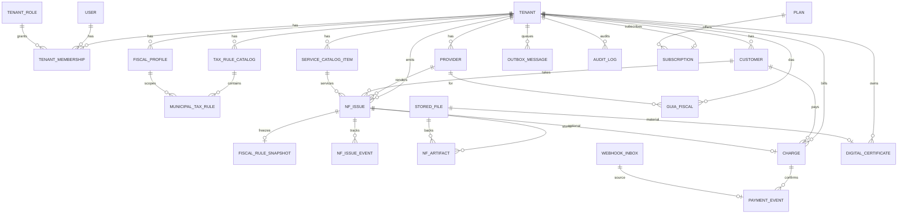

# EXEQ Hub v3.1 — Database Design & ERD

| Campo | Valor |
|-------|-------|
| Documento | Exeq_Hub_v3 — Database Design & ERD |
| Versão | **3.1.0** |
| Status | **Aprovado para kickoff de desenvolvimento (schema MVP)** |
| Data | 2026-07-19 |
| Substitui | Exeq_Hub_v3.0 (outline conceitual) |
| Hierarquia | Documento 3 do Contrato de Desenvolvimento |
| Stack alvo | PostgreSQL 16 + Django 5.x ORM |
| Autores | Arquitetura + Dados + Engenharia + Requisitos + Full Stack (consolidado) |

---

## 0. Decisão de aprovação

Este documento é a **única referência oficial de banco** para criar models, migrations e políticas RLS do EXEQ Hub.

- **Pode** iniciar Sprint 0 / `accounts` / `master_data` / `fiscal` / `issuance` / `billing` / `das` com base neste DER.
- **Não pode** criar tabelas de CRM, Car Wash ou outros módulos fora da seção 15 (fora de escopo MVP).
- Conflito com v1 funcional → **parar** e escalar (Contrato). Este v3.1 alinha-se à especificação Django de domínio (fábrica) e aos princípios do v2/Contrato.

### Relação com outros documentos

| Doc | Papel | Relação com v3.1 |
|-----|-------|------------------|
| Contrato | Processo | Este arquivo cumpre Documento 3 |
| v1 (domínio) | Regras / FSM / aceite | Schema cobre entidades necessárias às regras |
| v2 (arquitetura) | Engines, Outbox, Storage | Tabelas suportam engines oficiais |
| v4 / v5 | API / UX | Ainda pendentes; schema não depende deles para existir |

---

## 1. Objetivo

Definir o modelo físico/lógico de dados do SaaS multi-tenant EXEQ Hub (NFS-e, cobrança, DAS/DARF, plataforma) de forma **implementável**: entidades, campos, tipos, constraints, índices, RLS, exclusão, partição, migração e mapeamento Django.

---

## 2. Princípios oficiais

1. **Tenant First** — toda tabela de negócio tem `tenant_id` (exceto tabelas platform-global listadas).
2. **PostgreSQL 16** + **Django ORM** como caminho padrão; SQL cru só para RLS, Generated columns e partições.
3. **UUID v4** como PK (`uuid.uuid4` / `gen_random_uuid()`).
4. **RLS obrigatória** em tabelas tenant-scoped + filtro de aplicação (`TenantModel`).
5. **Modular Monolith** — schemas lógicos por app Django; um único database.
6. **Dinheiro**
   - Transacional (nota, cobrança, pagamento): `BIGINT` centavos (`*_cents`), `CHECK > 0` ou `>= 0` conforme regra.
   - Guias Receita (DAS/DARF): `NUMERIC(14,2)` em reais (paridade com retorno oficial); `valor_total` gerado.
   - **Proibido** `float` / `double`.
7. **UTC** em todos os `timestamptz` / `DateTimeField(UTC)`.
8. **Idempotência** — operações reenviáveis têm `idempotency_key` único por tenant.
9. **Soft delete / inativação** conforme matriz §11 — nunca apagar nota/guia/pagamento por hard delete de negócio.
10. **Sem Onion/CQRS/UoW** no modelo — tables ≈ aggregates Django idiomáticos.

---

## 3. Glossário canônico (obrigatório)

Nomes **oficiais no banco/ORM** (coluna esquerda). Sinônimos do v3.0 e da spec fábrica à direita.

| Oficial v3.1 (Model / tabela) | Spec fábrica / v3.0 | App Django |
|-------------------------------|---------------------|------------|
| `Tenant` | Tenant / empresa | `accounts` |
| `User` | User | `accounts` |
| `TenantMembership` | Membership / user_roles | `accounts` |
| `TenantRole` | Role (não Django Group global) | `accounts` |
| `TenantSecret` | tokens Focus/gateway | `accounts` |
| `Plan` / `Subscription` / `Feature` / `TenantFeature` | Feature flags / planos | `accounts` |
| `ApiKey` | API machine | `accounts` |
| `DigitalCertificate` | Certificado A1 | `accounts` |
| `CertificateAudit` | auditoria de certificado | `accounts` |
| `ElectronicProxy` | Procuração e-CAC | `accounts` |
| `StoredFile` | artefato em object storage | `platform` / shared |
| `AuditLog` | AuditLog (sai de issuance) | `platform` |
| `OutboxMessage` | Outbox | `platform` |
| `Notification` | notificação outbound | `platform` |
| `Provider` | Provider / prestador | `master_data` |
| `Customer` | Customer / tomador | `master_data` |
| `ServiceCatalogItem` | ServiceCatalog / serviço | `master_data` |
| `FiscalProfile` | FiscalProfile | `fiscal` |
| `TaxRuleCatalog` | TaxRuleCatalog | `fiscal` |
| `MunicipalTaxRule` | TaxRule / regra municipal | `fiscal` |
| `NfIssue` | Invoice / nf_issue | `issuance` |
| `NfIssueEvent` | InvoiceEvent | `issuance` |
| `NfIssueItem` | InvoiceItem (opcional MVP+) | `issuance` |
| `FiscalRuleSnapshot` | snapshot da regra na nota | `issuance` |
| `NfArtifact` | XML/PDF da nota | `issuance` |
| `Charge` | BillingDocument / cobrança | `billing` |
| `PaymentEvent` | evento de pagamento | `billing` |
| `WebhookInbox` | inbox de webhooks | `billing` |
| `GuiaFiscal` | DAS / guia DAS\|DARF | `das` |
| `ChannelSession` | sessão WhatsApp | `channel` |
| `ChannelNotification` | notificação WhatsApp | `channel` |

**ADR-DB-001 — Nomenclatura:** manter `NfIssue` / `GuiaFiscal` (não renomear para Invoice/DAS genérico) para preservar rastreabilidade com regras do v1 e testes de referência. O termo “Invoice” do v3.0 é **alias documental**, não nome de tabela.

**ADR-DB-002 — Escopo:** CRM e Car Wash **fora do schema MVP**. Reservar apps futuros sem tabelas neste documento.

---

## 4. Convenções físicas

### 4.1 Naming

| Item | Convenção |
|------|-----------|
| Tabela | `snake_case` pluralizado pelo Django (`nf_issue`, `tenant_memberships`) |
| PK | `id` UUID |
| FK | `<model>_id` |
| Timestamps | `created_at`, `updated_at` (obrigatórios em tabelas mutáveis) |
| Soft flag | `is_active` (cadastros) ou `deleted_at` (quando retenção exigir) |
| JSON | `JSONB` |
| Enums | `VARCHAR` + `CHECK` / Django `choices` (sem PG ENUM nativo — facilita migrations) |

### 4.2 Campos base

**`TenantModel`** (abstrato — todas as tabelas de negócio):

| Campo | Tipo | Regra |
|-------|------|-------|
| id | UUID PK | default gen_random_uuid |
| tenant_id | UUID FK → tenants | NOT NULL, ON DELETE PROTECT |
| created_at | timestamptz | NOT NULL |
| updated_at | timestamptz | NOT NULL |

**Tabelas global-platform** (sem `tenant_id`): `plans`, `features`, e opcionalmente catálogo de `tenant_roles` seed.

### 4.3 on_delete padrão

| Relação | on_delete |
|---------|-----------|
| tenant → filhos | PROTECT |
| catálogo → regras | CASCADE (só draft operacional; published imutável na app) |
| nf_issue → events/artifacts | CASCADE |
| charge → payment_events | PROTECT |
| membership → user/tenant | CASCADE membership / PROTECT user |

---

## 5. Camadas e apps

```
Platform     → accounts + shared/platform tables
Core         → master_data
Modules      → fiscal, issuance, billing, das, channel
Integrations → sem tabelas de domínio próprias (ports); usa TenantSecret, WebhookInbox, OutboxMessage
```

Mapeamento Engine → tabelas principais:

| Engine (v2) | Tabelas |
|-------------|---------|
| TenantEngine | tenants, users, tenant_memberships, tenant_roles, subscriptions, tenant_features, api_keys |
| TaxEngine | fiscal_profiles, tax_rule_catalogs, municipal_tax_rules |
| InvoiceEngine | nf_issues, nf_issue_events, nf_issue_items, fiscal_rule_snapshots, nf_artifacts |
| BillingEngine | charges, payment_events, webhook_inboxes |
| CertificateEngine | digital_certificates, certificate_audits, stored_files |
| WebhookEngine | webhook_inboxes, outbox_messages, notifications |

---

## 6. PLATFORM — Identity, Tenancy, SaaS, Security

### 6.1 `tenants`

| Campo | Tipo Django | SQL / Constraint |
|-------|-------------|------------------|
| id | UUIDField PK | |
| slug | SlugField(64) | UNIQUE |
| legal_name | CharField(255) | NOT NULL |
| document | CharField(14) | NOT NULL, UNIQUE (CNPJ plataforma), CHECK length 14 |
| status | CharField(32) | `active\|suspended\|provisioning`, default `active` |
| focus_layout | CharField(16) | default `nfsen` |
| settings | JSONField | default `{}` |
| created_at / updated_at | DateTimeField | |

**Índices:** `UNIQUE(slug)`, `UNIQUE(document)`, `INDEX(status)`.

**RLS:** sim (exceto fluxos platform-admin com bypass controlado).

**Delete:** PROTECT — apenas `status=suspended`.

---

### 6.2 `users` (identidade global)

**ADR-DB-003 — Login:** identidade global (`users.email` UNIQUE). Acesso a empresas via `tenant_memberships`. Login exige **`tenant_slug` + email + senha**; resolve membership ativa.

| Campo | Tipo | Constraint |
|-------|------|------------|
| id | UUID PK | |
| email | EmailField | UNIQUE global |
| password | CharField | hasher Django (Argon2/PBKDF2) |
| name | CharField(255) | NOT NULL |
| is_active | BooleanField | default True |
| is_platform_admin | BooleanField | default False (staff EXEQ) |
| last_login_at | DateTimeField null | |
| created_at / updated_at | DateTimeField | |

**Não** carrega `tenant_id` direto — evita User 1:1 Tenant da spec antiga.

**RLS:** especial — listagem de users por tenant via join membership (política §10).

---

### 6.3 `tenant_roles` (catálogo)

| Campo | Tipo | Constraint |
|-------|------|------------|
| id | UUID PK | |
| code | CharField(64) | UNIQUE — `tenant_admin\|operator\|accountant\|readonly\|platform_ops` |
| name | CharField(128) | |
| is_system | BooleanField | default True |
| permissions | JSONField | lista de permission codes (MVP) |

Seed obrigatório na migration inicial: quatro papéis de tenant (+ platform_ops interno).

**ADR-DB-004 — RBAC:** **não** usar `auth_group` global como papel por tenant. Groups Django podem espelhar permissões técnicas; **autorização de negócio** usa `tenant_memberships.role_id`.

---

### 6.4 `tenant_memberships`

| Campo | Tipo | Constraint |
|-------|------|------------|
| id | UUID PK | |
| tenant_id | FK Tenant | PROTECT |
| user_id | FK User | CASCADE |
| role_id | FK TenantRole | PROTECT |
| is_active | BooleanField | default True |
| created_at / updated_at | | |

**UNIQUE** `(tenant_id, user_id)`.

**Índices:** `(tenant_id, is_active)`, `(user_id, is_active)`.

---

### 6.5 `plans` (global)

| Campo | Tipo | Constraint |
|-------|------|------------|
| id | UUID PK | |
| code | CharField(64) | UNIQUE |
| name | CharField(128) | |
| is_active | BooleanField | default True |
| limits | JSONField | ex. `{max_nf_month: 1000}` |
| created_at / updated_at | | |

Sem `tenant_id`. Sem RLS tenant (somente platform-admin escreve).

---

### 6.6 `subscriptions`

| Campo | Tipo | Constraint |
|-------|------|------------|
| id | UUID PK | |
| tenant_id | FK | UNIQUE (1 plan ativo simplificado MVP) ou UNIQUE parcial |
| plan_id | FK Plan | PROTECT |
| status | CharField | `trialing\|active\|past_due\|canceled` |
| current_period_start / end | DateTimeField null | |
| created_at / updated_at | | |

**MVP:** um subscription por tenant (`UNIQUE(tenant_id)`).

---

### 6.7 `features` (global) + `tenant_features`

**features:** `id`, `code` UNIQUE, `description`, `default_enabled`.

**tenant_features:**

| Campo | Constraint |
|-------|------------|
| tenant_id, feature_id | UNIQUE (tenant_id, feature_id) |
| enabled | Boolean |
| config | JSONField default `{}` |

---

### 6.8 `api_keys`

| Campo | Constraint |
|-------|------------|
| tenant_id | FK |
| name | CharField |
| key_prefix | CharField(16) | |
| key_hash | CharField(128) | hash do secret (nunca plaintext) |
| scopes | JSONField | |
| expires_at | null | |
| revoked_at | null | |
| last_used_at | null | |
| created_by_id | FK User null | |

**UNIQUE** `(tenant_id, key_prefix)`.

---

### 6.9 `tenant_secrets`

Armazena tokens Focus, Betha, gateway, Evolution, etc.

| Campo | Constraint |
|-------|------------|
| tenant_id | FK |
| provider | CharField(64) — `focus\|betha\|asaas\|evolution\|openai\|receita` |
| key_name | CharField(64) | |
| ciphertext | TextField | Fernet/KMS envelope |
| key_version | IntegerField | rotação |
| metadata | JSONField | não sensível |
| created_at / updated_at | | |

**UNIQUE** `(tenant_id, provider, key_name)`.

---

### 6.10 `digital_certificates`

| Campo | Tipo | Constraint |
|-------|------|------------|
| id | UUID PK | |
| tenant_id | FK | |
| provider_id | FK Provider null | certificado pode ser do tenant ou prestador |
| label | CharField(128) | |
| cnpj | CharField(14) | NOT NULL |
| not_before / not_after | DateTimeField | NOT NULL |
| thumbprint_sha256 | CharField(64) | UNIQUE por tenant |
| stored_file_id | FK StoredFile | material A1 criptografado |
| status | CharField | `active\|expiring\|expired\|revoked` |
| created_at / updated_at | | |

**UNIQUE** `(tenant_id, thumbprint_sha256)`.

**Índices:** `(tenant_id, status)`, `(tenant_id, not_after)`.

---

### 6.11 `certificate_audits`

| Campo | Constraint |
|-------|------------|
| tenant_id | FK |
| certificate_id | FK CASCADE |
| action | CharField — `uploaded\|activated\|rotated\|revoked\|used_sign\|downloaded` |
| actor_user_id | FK User null |
| metadata | JSONField |
| created_at | |

Append-only. Sem `updated_at`. Sem delete de negócio.

---

### 6.12 `stored_files`

| Campo | Constraint |
|-------|------------|
| tenant_id | FK null — null só para artefatos platform |
| backend | CharField — `local\|s3\|minio` |
| bucket | CharField(128) null |
| object_key | TextField | NOT NULL |
| content_type | CharField(128) | |
| size_bytes | BigIntegerField | >= 0 |
| checksum_sha256 | CharField(64) | |
| encryption | CharField(32) — `none\|sse\|envelope` |
| purpose | CharField(64) — `nf_xml\|nf_pdf\|certificate\|das_pdf\|upload\|backup` |
| created_at | |

**Índices:** `(tenant_id, purpose)`, `UNIQUE(backend, bucket, object_key)` (bucket null tratado como `''`).

Substitui `storage_path` textual solto da spec fábrica: `NfArtifact` e `GuiaFiscal` referenciam `stored_files`.

---

### 6.13 `audit_logs`

| Campo | Constraint |
|-------|------------|
| tenant_id | FK null (ações platform) |
| actor_user_id | FK null |
| actor_type | CharField — `user\|system\|worker\|api_key` |
| entity_type | CharField(64) | |
| entity_id | UUID | |
| action | CharField(64) | |
| before / after | JSONField null | |
| payload_hash | CharField(64) null | |
| correlation_id | UUID null | |
| ip | GenericIPAddress null | |
| created_at | |

**Índices:** `(tenant_id, created_at DESC)`, `(entity_type, entity_id)`, `(correlation_id)`.

Append-only. Particionamento futuro por mês (`created_at`).

---

### 6.14 `outbox_messages`

| Campo | Constraint |
|-------|------------|
| tenant_id | FK | |
| event_type | CharField(128) — ex. `nf_issue.authorized` | |
| aggregate_type | CharField(64) | |
| aggregate_id | UUID | |
| payload | JSONField | |
| status | CharField — `pending\|processing\|processed\|failed\|dead` | |
| attempts | IntegerField default 0 | |
| available_at | DateTimeField | default now — delay/backoff |
| processed_at | null | |
| last_error | TextField null | |
| correlation_id | UUID null | |
| created_at / updated_at | | |

**Índices (claim worker):**  
`INDEX (status, available_at) WHERE status IN ('pending','failed')`  
`INDEX (tenant_id, event_type, created_at)`.

**ADR-DB-005:** emissão **não** chama WhatsApp/Email/Webhook síncrono; grava outbox na mesma transação do commit de domínio.

---

### 6.15 `notifications`

| Campo | Constraint |
|-------|------------|
| tenant_id | FK |
| channel | CharField — `email\|whatsapp\|webhook` |
| to_address | CharField(255) | |
| template_code | CharField(64) | |
| payload | JSONField | |
| status | `pending\|sent\|failed` | |
| outbox_message_id | FK null | |
| provider_ref | CharField null | |
| created_at / updated_at / sent_at | |

---

## 7. CORE — master_data

### 7.1 `providers`

| Campo | Constraint |
|-------|------------|
| tenant_id | FK |
| document | CharField(14) CNPJ |
| legal_name | CharField NOT NULL |
| trade_name | CharField null |
| municipal_registration | CharField(32) null |
| tax_regime | `simples_nacional\|lucro_presumido\|lucro_real` |
| address | JSONField default `{}` — schema documentado em v4 |
| is_active | Boolean default True |
| created_at / updated_at | |

**UNIQUE** `(tenant_id, document)`.

**Delete:** soft via `is_active=False` apenas.

---

### 7.2 `customers`

| Campo | Constraint |
|-------|------------|
| tenant_id | FK |
| document | CharField(14) | |
| document_type | `cpf\|cnpj` | |
| name | CharField NOT NULL | |
| email | EmailField null | |
| address | JSONField default `{}` | |
| is_active | Boolean default True | |
| created_at / updated_at | |

**UNIQUE** `(tenant_id, document)`.  
CHECK: cpf → length 11; cnpj → length 14 (validação DV na Application/Domain layer).

---

### 7.3 `service_catalog_items`

| Campo | Constraint |
|-------|------------|
| tenant_id | FK |
| service_code | CharField(32) |
| description | TextField |
| lc116_item | CharField(16) null |
| codigo_tributacao_nacional_iss | CharField(16) blank — código ISS nacional (Focus `/v2/nfsen`); distinto de LC116 municipal |
| is_active | Boolean default True |
| created_at / updated_at | |

**UNIQUE** `(tenant_id, service_code)`.

---

## 8. FISCAL — TaxEngine

### 8.1 `fiscal_profiles`

| Campo | Constraint |
|-------|------------|
| tenant_id | FK |
| name | CharField |
| tax_regime | choices regime |
| iss_retention_policy | CharField(32) default `by_rule` |
| status | CharField default `active` |
| created_at / updated_at | |

**UNIQUE** `(tenant_id, name)`.

---

### 8.2 `tax_rule_catalogs`

| Campo | Constraint |
|-------|------------|
| tenant_id | FK |
| version | IntegerField | |
| status | `draft\|published\|superseded` | |
| publish_checklist | JSONField default `{csv_validated:false, rules_reviewed:false, terms_accepted:false}` | |
| published_at | null | |
| created_at / updated_at | |

**UNIQUE** `(tenant_id, version)`.

**UNIQUE parcial (PG):** no máximo um `published` por tenant:  
`CREATE UNIQUE INDEX uq_tax_catalog_one_published ON tax_rule_catalogs (tenant_id) WHERE status = 'published';`

Imutabilidade de published/superseded é regra de **Domain Service** (não editar rules).

---

### 8.3 `municipal_tax_rules`

| Campo | Constraint |
|-------|------------|
| tenant_id | FK |
| catalog_id | FK TaxRuleCatalog CASCADE |
| fiscal_profile_id | FK FiscalProfile PROTECT |
| ibge_code | CharField(7) |
| municipio_nome | CharField(128) |
| uf | CharField(2) |
| service_code | CharField(32) |
| tax_regime | choices |
| iss_rate / irrf_rate / pis_rate / cofins_rate | DecimalField(7,4) |
| iss_retained | Boolean |
| simples_codigo_tributacao | SmallIntegerField null |
| valid_from | DateField |
| valid_to | DateField null |
| priority | IntegerField default 100 |
| focus_field_overrides | JSONField default `{}` |
| created_at / updated_at | |

**UNIQUE** `(tenant_id, catalog_id, fiscal_profile_id, ibge_code, service_code, tax_regime, valid_from)`.

**Índices de resolução (TaxEngine):**  
`(tenant_id, ibge_code, service_code, tax_regime, valid_from DESC, priority ASC)`  
+ filtro por `catalog_id` published na query.

---

## 9. ISSUANCE — InvoiceEngine

### 9.1 `nf_issues`

| Campo | Constraint |
|-------|------------|
| tenant_id | FK |
| idempotency_key | CharField(128) |
| status | `draft\|pending_tax\|queued\|submitting\|polling\|authorized\|rejected\|cancelled\|failed` |
| provider_id | FK Provider PROTECT |
| customer_id | FK Customer PROTECT |
| service_id | FK ServiceCatalogItem PROTECT |
| fiscal_profile_id | FK FiscalProfile null PROTECT |
| ibge_code | CharField(7) |
| competence_date | DateField |
| amount_cents | BigIntegerField CHECK > 0 |
| resolved_rule_id | FK MunicipalTaxRule null SET_NULL |
| fiscal_rule_snapshot_id | FK FiscalRuleSnapshot null PROTECT |
| resolved_params | JSONField null |
| internal_payload | JSONField null |
| focus_status_raw | JSONField null |
| focus_ref | CharField(128) null |
| payload_hash | CharField(64) null |
| correlation_id | UUID NOT NULL |
| rejection_code | CharField(64) null — ex. `TAX_RULE_NOT_FOUND` |
| created_at / updated_at | |

**UNIQUE** `(tenant_id, idempotency_key)`.

**Índices:**  
`(tenant_id, status, created_at DESC)`  
`(tenant_id, competence_date)`  
`(tenant_id, focus_ref)` WHERE focus_ref IS NOT NULL  
`(tenant_id, correlation_id)`.

**Particionamento (§13):** preparar `PARTITION BY RANGE (competence_date)` a partir de volume (~1M+ rows) ou já em homologação se ops preferir; MVP pode ser tabela heap com migration path documentada.

FSM: regras no Domain Service / InvoiceEngine (não no CHECK SQL completo — CHECK opcional de status ∈ conjunto).

---

### 9.2 `fiscal_rule_snapshots`

Congela a regra aplicada no momento da resolução (sobrevive a supersede).

| Campo | Constraint |
|-------|------------|
| tenant_id | FK |
| nf_issue_id | FK UNIQUE (1:1) CASCADE ou SET após create |
| source_rule_id | UUID null — id original, sem FK obrigatória |
| catalog_version | Integer |
| snapshot | JSONField — rates, codes, ibge, service, regime, priority |
| created_at | |

---

### 9.3 `nf_issue_events`

| Campo | Constraint |
|-------|------------|
| tenant_id | FK (desnormalizado para RLS) |
| nf_issue_id | FK CASCADE |
| from_status | CharField null |
| to_status | CharField NOT NULL |
| actor | CharField(64) — `api\|worker\|provider\|system` |
| metadata | JSONField null |
| occurred_at | DateTimeField auto_now_add |

**Índice:** `(nf_issue_id, occurred_at)`.

Append-only. Toda mudança de `nf_issues.status` **exige** um evento na mesma transação.

---

### 9.4 `nf_issue_items` (MVP+ opcional)

Para notas multi-serviço futuras. **MVP:** uma nota = um `service_id` em `nf_issues`; tabela pode ser criada vazia/habilitada por feature flag.

| Campo | Constraint |
|-------|------------|
| tenant_id | FK |
| nf_issue_id | FK CASCADE |
| service_id | FK |
| description | TextField |
| amount_cents | BigInteger CHECK > 0 |
| quantity | Decimal(12,4) default 1 |

---

### 9.5 `nf_artifacts`

| Campo | Constraint |
|-------|------------|
| tenant_id | FK |
| nf_issue_id | FK CASCADE |
| kind | `xml\|pdf` |
| stored_file_id | FK StoredFile PROTECT |
| checksum_sha256 | CharField(64) | |
| created_at | |

**UNIQUE** `(nf_issue_id, kind)`.

---

## 10. BILLING — BillingEngine + WebhookEngine (inbound)

### 10.1 `charges`

| Campo | Constraint |
|-------|------------|
| tenant_id | FK |
| idempotency_key | CharField(128) |
| status | `pending\|registered\|paid\|overdue\|cancelled\|failed` |
| customer_id | FK PROTECT |
| amount_cents | BigInteger CHECK > 0 |
| due_date | DateField |
| description | TextField null |
| gateway_ref | CharField(128) null |
| nf_issue_id | FK NfIssue null SET_NULL |
| correlation_id | UUID |
| created_at / updated_at | |

**UNIQUE** `(tenant_id, idempotency_key)`.  
**Índices:** `(tenant_id, status, due_date)`, `(tenant_id, gateway_ref)`.

---

### 10.2 `webhook_inboxes`

| Campo | Constraint |
|-------|------------|
| tenant_id | FK |
| provider | CharField(32) — `asaas\|mercado_pago\|focus\|evolution` |
| idempotency_key | CharField(128) |
| status | `received\|processing\|processed\|failed` |
| signature | CharField(256) null |
| signature_valid | BooleanField | |
| raw_payload | JSONField | |
| payload_hash | CharField(64) | |
| error_message | TextField null | |
| processed_at | null | |
| created_at / updated_at | |

**UNIQUE** `(tenant_id, provider, idempotency_key)`.

**ADR-DB-006:** payload só é processado após persistir inbox; assinatura inválida → HTTP 401 e **não** marca como confiável (`signature_valid=false`, preferencialmente nem cria PaymentEvent).

---

### 10.3 `payment_events`

| Campo | Constraint |
|-------|------------|
| tenant_id | FK |
| charge_id | FK PROTECT |
| webhook_inbox_id | FK SET_NULL null |
| amount_cents | BigInteger CHECK > 0 |
| paid_at | DateTimeField |
| gateway_ref | CharField null |
| metadata | JSONField null |
| created_at | |

**Índice:** `(charge_id, paid_at)`.  
Charge → `paid` somente via Application Service após PaymentEvent compatível.

---

## 11. DAS — GuiaFiscal

### 11.1 `guias_fiscais`

| Campo | Constraint |
|-------|------------|
| tenant_id | FK |
| provider_id | FK PROTECT |
| tipo_guia | `DAS\|DARF` |
| competencia | CharField(7) CHECK `^\d{4}-\d{2}$` |
| data_vencimento | DateField null |
| valor_principal | Decimal(14,2) >= 0 default 0 |
| valor_multa | Decimal(14,2) >= 0 default 0 |
| valor_juros | Decimal(14,2) >= 0 default 0 |
| valor_total | GeneratedField / Generated column = soma |
| linha_digitavel | TextField null |
| pix_copia_cola | TextField null |
| status | `PROCESSANDO\|DISPONIVEL\|PAGO\|CANCELADO\|RETIFICADO\|VENCIDO\|EM_CONTESTACAO` |
| compliance_status | `pendente\|aprovado\|bloqueado\|dispensado` |
| compliance_motivo | TextField null |
| pdf_file_id | FK StoredFile null |
| versao_atual | IntegerField >= 1 default 1 |
| idempotency_key | CharField(128) |
| metadata | JSONField default `{}` |
| created_at / updated_at | |

**UNIQUE** `(tenant_id, idempotency_key)`.  
**UNIQUE** `(tenant_id, provider_id, tipo_guia, competencia, versao_atual)`.

**ADR-DB-007 — Money misto:** DAS permanece em `NUMERIC(14,2)` por contrato com Receita; demais fluxos em centavos. Conversões só em Domain Service tipado.

---

### 11.2 `electronic_proxies` (procuração eletrônica e-CAC)

**ADR-DB-008 — Procuração:** canal SERPRO Integra Contador em modo `TERCEIROS` exige vínculo de procuração eletrônica entre o CNPJ do prestador (outorgante) e o CNPJ/CPF do outorgado (contratante/autor do pedido). O Hub persiste o vínculo; a validade jurídica permanece no e-CAC.

| Campo | Constraint |
|-------|------------|
| tenant_id | FK |
| provider_id | FK Provider SET_NULL null |
| principal_cnpj | CharField(14) — outorgante (contribuinte) |
| proxy_document | CharField(14) — outorgado (CNPJ ou CPF) |
| proxy_document_type | `cnpj\|cpf` |
| ecac_service_codes | JSONField — ex. `["PGDASD","GERARDAS12"]` |
| status | `pending\|active\|expiring\|expired\|revoked` |
| valid_from | DateField |
| valid_to | DateField null |
| label | CharField(128) |
| metadata | JSONField default `{}` |
| created_at / updated_at | |

**UNIQUE** `(tenant_id, principal_cnpj, proxy_document)` onde `status IN (pending, active, expiring)`.  
**Índices:** `(tenant_id, principal_cnpj, status)`, `(tenant_id, valid_to)`.

**Gate DAS (HTTP SERPRO):** `emitir_guia` exige proxy **active/expiring** cobrindo o serviço PGDASD para o CNPJ do provider, além do certificado A1. Em `RECEITA_HTTP_MODE=stub` o gate é opcional (`DAS_REQUIRE_ELECTRONIC_PROXY=false` default).

---

## 12. CHANNEL (fase posterior — schema reservado)

### 12.1 `channel_sessions`

`tenant_id`, `idempotency_key`, `phone_e164`, `status` (`collecting|ready_to_confirm|emitted|expired|cancelled`), `draft_payload` JSON, `nf_issue_id` null, timestamps.  
**UNIQUE** `(tenant_id, idempotency_key)`.

### 12.2 `channel_notifications`

`tenant_id`, `session_id` null, `nf_issue_id` null, `phone_e164`, `event_type`, `message_body`, `status` (`pending|sent|failed`), timestamps.

Implementação de migrations: **Sprint channel**; criar tabelas já no início é opcional (feature flag). Recomendação: criar no mesmo repo na migration `channel` quando Sprint 7 iniciar.

---

## 13. Matriz de exclusão (soft vs hard)

| Entidade | Política |
|----------|----------|
| Tenant | Suspender (`status`); sem hard delete |
| User | `is_active=False` |
| Membership | `is_active=False` |
| Provider / Customer / Service | `is_active=False` |
| Tax catalogs published | Nunca delete; só `superseded` |
| NfIssue / Events / Artifacts | Sem hard delete de negócio |
| Charge / PaymentEvent | Sem hard delete |
| GuiaFiscal | Sem hard delete |
| WebhookInbox / Outbox / Audit / CertAudit | Append; purge só por job de retenção LGPD |
| StoredFile | Soft + lifecycle S3; hard após retenção |
| ApiKey | `revoked_at` |
| Certificate | `revoked` / `expired` |

---

## 14. Multi-Tenant & RLS

### 14.1 Variáveis de sessão

```sql
-- Por transação de request/worker (preferir SET LOCAL)
SET LOCAL app.tenant_id = '<uuid>';
SET LOCAL app.bypass_rls = 'off';  -- default
```

Bypass **somente** infraestrutura (login pré-auth, migrations, jobs platform-admin):

```sql
SET LOCAL app.bypass_rls = 'on';
```

Nunca aceitar bypass de parâmetro HTTP/JWT claim manipulável pelo cliente.

### 14.2 Política padrão (todas as tabelas com `tenant_id`)

```sql
ALTER TABLE <table> ENABLE ROW LEVEL SECURITY;
ALTER TABLE <table> FORCE ROW LEVEL SECURITY;

CREATE POLICY tenant_isolation ON <table>
  USING (
    current_setting('app.bypass_rls', true) = 'on'
    OR tenant_id::text = current_setting('app.tenant_id', true)
  )
  WITH CHECK (
    current_setting('app.bypass_rls', true) = 'on'
    OR tenant_id::text = current_setting('app.tenant_id', true)
  );
```

### 14.3 Workers / Celery

Todo task recebe `tenant_id` no payload; worker abre transação, `SET LOCAL app.tenant_id`, processa, commit. Teste obrigatório: task sem tenant_id falha; vazamento cross-tenant falha.

### 14.4 `users`

Política: bypass **ou** `id IN (SELECT user_id FROM tenant_memberships WHERE tenant_id = current_setting...)` para SELECT; writes de user management sob tenant context + role admin.

---

## 15. Índices — consolidado obrigatório

Além dos UNIQUE já citados, criar na migration inicial:

| Tabela | Índice |
|--------|--------|
| nf_issues | `(tenant_id, status, created_at DESC)` |
| nf_issues | `(tenant_id, competence_date)` |
| nf_issues | parcial `focus_ref` |
| municipal_tax_rules | resolução TaxEngine |
| charges | `(tenant_id, status, due_date)` |
| webhook_inboxes | `(tenant_id, status, created_at)` |
| outbox_messages | claim parcial pending/failed |
| guias_fiscais | `(tenant_id, competencia, status)` |
| audit_logs | `(tenant_id, created_at DESC)` |
| digital_certificates | `(tenant_id, not_after)` |
| stored_files | `(tenant_id, purpose)` |

`select_related` / `prefetch_related` obrigatórios nas listagens (orientação app — v2).

---

## 16. Particionamento e arquivamento

| Fase | Ação |
|------|------|
| MVP (< ~1M nf_issues) | Heap + índices; monitorar tamanho |
| Crescimento | `nf_issues` PARTITION BY RANGE (`competence_date`) mensal/trimestral |
| Arquivo frio | XML/PDF > N meses → storage classe Infrequent Access; DB mantém metadados |
| Audit/Outbox | partição mensal + purge processed outbox > 30–90 dias (config) |
| Read replica | listagens/relatórios quando CPU primary > limiar ops |

---

## 17. Estratégia de migração Django

1. App `shared` / `platform`: TenantModel, StoredFile, AuditLog, OutboxMessage.  
2. `accounts`: tenants → users → roles → memberships → secrets → certificates → plans/subscriptions/features → api_keys.  
3. `master_data` → `fiscal` → `issuance` → `billing` → `das` → `channel`.  
4. RLS via `RunSQL` em migration dedicada `****_enable_rls.py` **após** create model.  
5. **Nunca** editar migration já aplicada em ambiente compartilhado.  
6. Seed: roles, plans básicos, feature flags default.  
7. Zero downtime: add nullable → backfill → constrain.

Greenfield: sem migração de dados do Node legado.

---

## 18. Storage Interface (dados)

`stored_files.backend ∈ {local, s3, minio}`.  
Certificate material e PDFs **sempre** via StoredFile + encryption envelope.  
Nenhum path absoluto de filesystem em tabelas de domínio além do object_key.

---

## 19. Outbox — eventos canônicos (payload mínimo)

| event_type | Disparo |
|------------|---------|
| `nf_issue.authorized` | status → authorized |
| `nf_issue.rejected` | rejected |
| `nf_issue.cancelled` | cancelled |
| `charge.paid` | Charge paid |
| `guia_fiscal.available` | Guia DISPONIVEL |
| `certificate.expiring` | job diário not_after < 30d |

Consumidores: Notification / WhatsApp / Email / Webhook outbound — **somente** via worker.

---

## 20. ERD lógico (Mermaid)



---

## 21. Checklist de aceite do schema (Definition of Done v3.1)

Toda tabela MVP deve ter:

- [x] PK UUID especificada  
- [x] `tenant_id` quando aplicável  
- [x] UNIQUE / CHECK documentados  
- [x] Índices de consulta documentados  
- [x] Política de exclusão (§13)  
- [x] Política RLS (§14)  
- [x] Mapeamento app Django + Engine  
- [x] Glossário canônico (§3)  
- [ ] Migrations Django criadas (fase implementação)  
- [ ] Testes de isolamento tenant (fase implementação)  
- [ ] Teste bypass_rls negativo (fase implementação)  

---

## 22. Ordem de implementação sugerida (dados)

1. Sprint 0: Postgres + extensões `pgcrypto`; apps platform/accounts skeleton.  
2. accounts completo + RLS base + seeds roles.  
3. master_data.  
4. fiscal (+ índice resolução).  
5. stored_files + certificates.  
6. issuance + outbox + artifacts.  
7. billing + webhook_inbox.  
8. das.  
9. channel (quando autorizado).  
10. partição nf_issues quando métrica atingir limiar.

---

## 23. Itens explicitamente fora do v3.1 MVP

- Tabelas CRM / Car Wash / DCTF / eSocial  
- Multi-currency  
- Sharding cross-database  
- PG ENUM types  
- Hard delete cascata de tenant em produção  

---

## 24. Histórico

| Versão | Mudança |
|--------|---------|
| 3.0 | Outline conceitual (não implementável) |
| **3.1.0** | DER completo para kickoff: Platform + Core + Fiscal + Issuance + Billing + DAS; Membership; Certificates; Outbox; RLS; glossário; ADRs DB-001..007 |
| **3.1.1** | `electronic_proxies` (e-CAC) + ADR-DB-008; gate DAS HTTP SERPRO |

---

## 25. Aprovação

| Papel | Status |
|-------|--------|
| Arquitetura | Documento emitido para uso oficial |
| Dados / DB | Schema MVP pronto para migrations |
| Engenharia | Pode iniciar models na ordem §22 |
| Requisitos | Alinhado às regras da spec Django (v1 de domínio) |
| Full Stack | Contratos de dados estáveis para API (v4) e Admin (v5) |

**Próximos documentos bloqueantes para telas/contratos HTTP:** Exeq_Hub_v4 (API) e Exeq_Hub_v5 (UX). O **schema de banco** não fica bloqueado por v4/v5.
