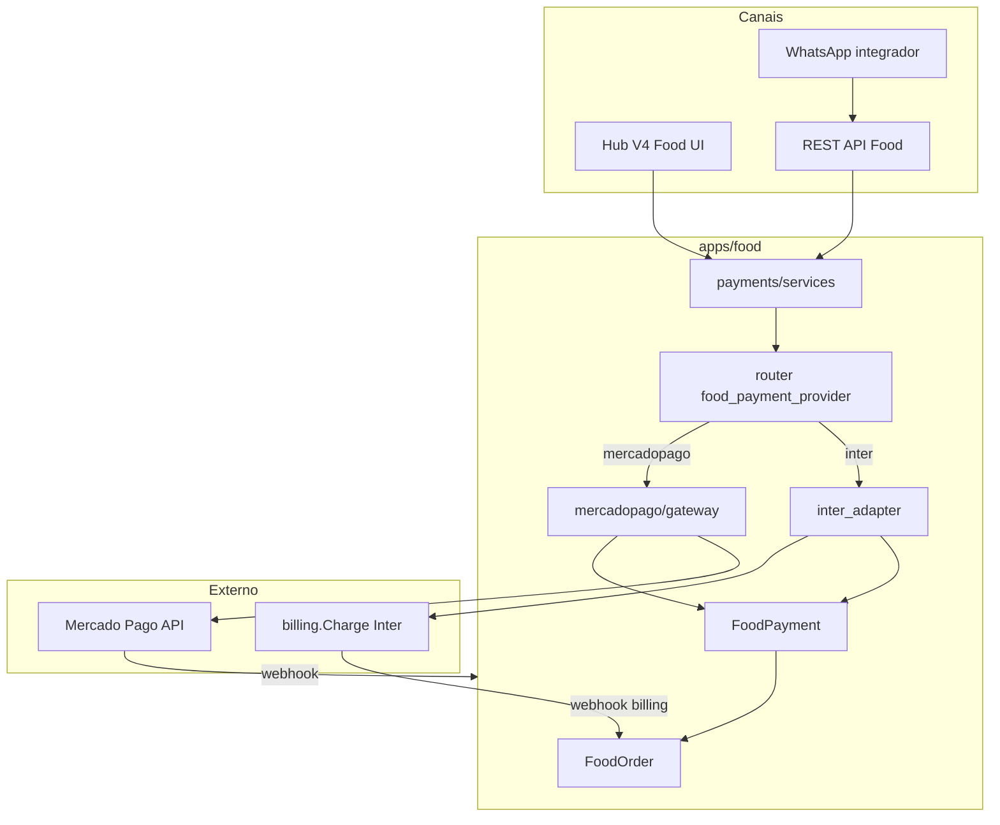

# EXEQ Hub Food — Entrega de Pagamentos (Mercado Pago + Inter)

**Commit:** `95e0282` · branch `feat/nfse-emissor-piloto-m5`  
**Escopo:** somente `apps/food/**` — billing recorrente, channel e hub_v4 core **não** foram alterados.

Documento para **devops/configuração** e **roteiro de validação QA**.

---

## 1. Resumo da entrega

Pagamentos do módulo **Food** passam a ter stack própria, isolada do billing recorrente (Inter/Asaas/C6 para assinaturas e boletos).

| Capacidade | Mercado Pago | Inter (legado Food) |
|------------|--------------|---------------------|
| Pix copia e cola | Sim (`FoodPayment`) | Sim (`billing.Charge`) |
| Cartão checkout transparente | Sim (Hub + API) | Não |
| Webhook dedicado Food | `POST /api/v1/food/webhooks/mercadopago` | Webhook billing existente |
| WhatsApp (texto pronto na API) | Sim | Sim (via Charge) |
| Agregado nativo | `FoodPayment` + `FoodPaymentEvent` | `FoodPayment` espelha `Charge` |

### EPICs incluídos

| EPIC | Conteúdo | Status |
|------|----------|--------|
| **0** | Models `FoodPayment`, `FoodPaymentEvent`; migration `0006`; `mark_order_paid()` generalizado | Entregue |
| **1** | Package `apps/food/payments/` (router, registry, port, services) | Entregue |
| **2** | Mercado Pago Pix (`create_pix_payment`, e-mail obrigatório) | Entregue |
| **3** | Webhook MP com `x-signature`, dedupe por evento | Entregue |
| **4** | Hub UI — painel de pagamento em `/hub/food/pedidos/<id>/` | Entregue |
| **5** | Cartão MP transparente (`mp-checkout.js`, action `card`) | Entregue |
| **6** | Contrato WhatsApp — campo `whatsapp_payment` + doc API | Entregue |

---

## 2. Arquitetura (visão rápida)



**Decisão chave:** `tenant.settings.food_payment_provider` é **independente** de `tenant.settings.payment_provider` (billing).

---

## 3. Pré-requisitos de deploy

### 3.1 Migration

```bash
python manage.py migrate food
```

Migration obrigatória: `apps/food/migrations/0006_food_payment_foundation.py`

### 3.2 Infra local (lab)

```bash
docker compose up -d db redis
python manage.py migrate
python manage.py runserver
```

Postgres lab: `127.0.0.1:5433` (ver `.env.example`).

### 3.3 Dependências de runtime

- `FIELD_ENCRYPTION_KEY` configurada (TenantSecret criptografado)
- Cliente Food com **e-mail** quando provider = Mercado Pago
- URL pública HTTPS para webhook MP em staging/prod

---

## 4. Configuração

### 4.1 Variáveis de ambiente

| Variável | Default | Uso |
|----------|---------|-----|
| `PAYMENT_HTTP_MODE` | `stub` | `stub` = respostas simuladas; `http` = API real (Inter + fallback MP) |
| `FOOD_MP_HTTP_MODE` | *(vazio)* | Override só Mercado Pago Food (`stub` \| `http`) |
| `FOOD_MP_WEBHOOK_SECRET` | *(vazio)* | Fallback global de assinatura webhook MP (lab); prod → TenantSecret |
| `MERCADOPAGO_ACCESS_TOKEN` | *(vazio)* | Fallback env se tenant não tiver secret |
| `MERCADOPAGO_PUBLIC_KEY` | *(vazio)* | Fallback env para checkout cartão no Hub |
| `WEBHOOK_ALLOWED_IPS` | *(vazio)* | Allowlist IP webhook (vazio = lab permissivo) |

Exemplo lab (stub, sem credenciais reais):

```env
PAYMENT_HTTP_MODE=stub
FOOD_MP_WEBHOOK_SECRET=lab-mp-webhook-secret-change-me
```

Exemplo sandbox Mercado Pago:

```env
PAYMENT_HTTP_MODE=http
FOOD_MP_HTTP_MODE=http
MERCADOPAGO_ACCESS_TOKEN=TEST-...
MERCADOPAGO_PUBLIC_KEY=TEST-...
FOOD_MP_WEBHOOK_SECRET=<secret configurado no painel MP>
```

### 4.2 Settings do tenant

Configurar em Admin Django ou API de tenant (`tenant.settings` JSON):

**Mercado Pago (recomendado para piloto Food):**

```json
{
  "food_payment_provider": "mercadopago",
  "food_payment_methods_enabled": ["pix", "card"]
}
```

**Inter (comportamento legado — default se omitido):**

```json
{
  "food_payment_provider": "inter"
}
```

> **Atenção Inter:** `food_payment_provider=inter` exige `payment_provider=inter` alinhado no billing (adapter reutiliza `create_charge`).

### 4.3 TenantSecret (produção / sandbox)

Provider: `mercadopago`

| key_name | Obrigatório | Descrição |
|----------|-------------|-----------|
| `access_token` | Sim (HTTP) | Token MP (TEST-… ou APP_USR-…) |
| `public_key` | Sim (cartão Hub) | Public key MP para `mp-checkout.js` |
| `webhook_secret` | Sim (webhook) | Secret de assinatura configurado no painel MP |

Exemplo via shell Django:

```python
from apps.accounts.models import Tenant
from apps.accounts.secrets import set_tenant_secret

tenant = Tenant.objects.get(slug="seu-tenant")

set_tenant_secret(
    tenant=tenant,
    provider="mercadopago",
    key_name="access_token",
    plaintext="TEST-xxxxxxxx",
)
set_tenant_secret(
    tenant=tenant,
    provider="mercadopago",
    key_name="public_key",
    plaintext="TEST-xxxxxxxx",
)
set_tenant_secret(
    tenant=tenant,
    provider="mercadopago",
    key_name="webhook_secret",
    plaintext="seu-webhook-secret",
)
```

### 4.4 Webhook Mercado Pago (painel MP)

| Item | Valor |
|------|-------|
| URL | `https://<seu-dominio>/api/v1/food/webhooks/mercadopago` |
| Eventos | Pagamentos (`payment`) |
| Assinatura | Habilitar; secret = `TenantSecret.webhook_secret` |

Headers esperados pelo Hub:

- `x-signature` — `ts=...,v1=<hmac-sha256>`
- `x-request-id` — id único da notificação

Query string: `?data.id=<payment_id>&type=payment` (padrão MP).

### 4.5 Dados mínimos para teste

1. **Tenant** com slug conhecido e usuário `tenant_admin`
2. **Produto Food** ativo com estoque (`POST /api/v1/food/products/`)
3. **Cliente Food** com nome, documento e **e-mail** (MP)
4. Provider configurado conforme cenário (stub / MP / Inter)

---

## 5. Endpoints relevantes

| Método | Path | Descrição |
|--------|------|-----------|
| `POST` | `/api/v1/food/orders/` | Criar pedido; `request_payment=true` emite pagamento |
| `POST` | `/api/v1/food/orders/{id}/pix/` | Emitir / reutilizar intent Pix |
| `POST` | `/api/v1/food/orders/{id}/payment-intent/` | Intent genérico (`method`, `token` para cartão) |
| `POST` | `/api/v1/food/webhooks/mercadopago` | Webhook MP (público, assinado) |
| `GET` | `/hub/food/pedidos/` | Lista pedidos Hub |
| `GET/POST` | `/hub/food/pedidos/{id}/` | Detalhe + ações Pix/cartão/transição |

Autenticação API: `POST /api/v1/auth/login` → header `Authorization: Bearer <token>`.

Contrato WhatsApp detalhado: [PAYMENT_API_WHATSAPP.md](./PAYMENT_API_WHATSAPP.md)

---

## 6. Roteiro QA — validação manual

**Fase A (stub) passo a passo com links e credenciais:** [QA_FASE_A_STUB_ROTEIRO.md](./QA_FASE_A_STUB_ROTEIRO.md)

Use checklist abaixo como visão geral. Marque **Pass/Fail** e anexe evidência (screenshot, response JSON, id do pedido).

### Fase A — Lab stub (sem credenciais MP)

Objetivo: validar fluxo end-to-end sem gateway real.

| ID | Cenário | Passos | Resultado esperado |
|----|---------|--------|-------------------|
| **A1** | Migration | `migrate food` | `0006_food_payment_foundation` aplicada |
| **A2** | Router default | Tenant sem `food_payment_provider` → Pix Inter | `POST .../pix/` cria `billing.Charge` |
| **A3** | Router MP stub | `food_payment_provider=mercadopago`, `PAYMENT_HTTP_MODE=stub` | Cria `FoodPayment`, **não** chama billing |
| **A4** | Pix stub MP | `POST .../orders/{id}/pix/` | `pix_copy_paste` começa com `000201` |
| **A5** | Idempotência | Repetir `pix` no mesmo pedido | Mesmo `FoodPayment`, sem duplicata |
| **A6** | E-mail obrigatório MP | Cliente sem e-mail + MP | HTTP 422, code `food_payment_email_required` |
| **A7** | WhatsApp CA-6.1 | `POST orders` channel=whatsapp, `request_payment=true` | `whatsapp_payment.ready=true`, mensagem com Pix |
| **A8** | WhatsApp CA-6.2 | `channel=counter` + `request_payment` | `whatsapp_payment` = `null` |
| **A9** | Cartão rejeitado WA | `channel=whatsapp`, `payment_method=card` | HTTP 400, `food_payment_method_not_allowed` |
| **A10** | Hub painel MP | Abrir pedido MP com Pix emitido | Painel mostra provider Mercado Pago + copia e cola |
| **A11** | Hub cartão stub | Action `card` no Hub (stub token) | Mensagem sucesso/recusa conforme stub |
| **A12** | Webhook assinatura inválida | POST webhook sem `x-signature` válida | HTTP 401 |
| **A13** | Webhook pago stub | Simular webhook MP aprovado (ver testes) | Pedido `paid` + `confirmed`, estoque debitado |

### Fase B — Sandbox Mercado Pago (HTTP real)

Pré-condição: credenciais TEST, webhook apontando para URL pública (ngrok ou staging).

| ID | Cenário | Passos | Resultado esperado |
|----|---------|--------|-------------------|
| **B1** | Pix real | Criar pedido + intent Pix | QR/copia-e-cola válido no app MP test |
| **B2** | Pagamento Pix | Pagar no app MP test user | Webhook → pedido pago em ≤ 60s |
| **B3** | Cartão aprovado | Hub checkout cartão (cartão test MP) | Pedido pago ou mensagem clara de recusa |
| **B4** | Dedupe webhook | Reenviar mesmo evento MP | HTTP 200, pedido não duplica baixa estoque |
| **B5** | TenantSecret | Remover `access_token` do tenant | Erro claro ao emitir Pix (sem fallback indevido em prod) |

### Fase C — Inter legado (regressão)

| ID | Cenário | Passos | Resultado esperado |
|----|---------|--------|-------------------|
| **C1** | Food Inter | `food_payment_provider=inter`, stub | `Charge` criada, pedido `awaiting_pix` |
| **C2** | Webhook billing | Webhook Inter existente paga charge | Pedido Food vinculado → `paid` |
| **C3** | Billing intacto | Emitir cobrança recorrente billing | Fluxo billing **inalterado** |

### Fase D — Segurança e limites

| ID | Cenário | Resultado esperado |
|----|---------|-------------------|
| **D1** | Webhook IP bloqueado | Com `WEBHOOK_ALLOWED_IPS` restritivo → 403 |
| **D2** | Payload grande webhook | Body > 256 KB → 413 |
| **D3** | Mensagem WhatsApp | `len(message) ≤ 4096` |
| **D4** | Multi-tenant | Pagamento MP de tenant A não afeta tenant B |

---

## 7. Testes automatizados (CI / dev)

Rodar suite Food pagamentos:

```bash
python -m pytest apps/food/tests/test_payment_router.py -q
python -m pytest apps/food/tests/test_mp_pix.py -q
python -m pytest apps/food/tests/test_mp_webhook.py -q
python -m pytest apps/food/tests/test_mp_webhook_security.py -q
python -m pytest apps/food/tests/test_mp_card.py -q
python -m pytest apps/food/tests/test_hub_payment_ui.py -q
python -m pytest apps/food/tests/test_whatsapp_payment_contract.py -q
```

Suite completa Food:

```bash
python -m pytest apps/food/tests/ -q
```

Offline sem Postgres:

```powershell
$env:EXEQ_TEST_SQLITE="1"
python -m pytest apps/food/tests/test_whatsapp_payment_contract.py -q
```

*(Preferir Postgres para testes de integração com billing.)*

### Mapa teste → critério QA

| Arquivo de teste | Cobre |
|------------------|-------|
| `test_payment_router.py` | A2, A3, C1 |
| `test_mp_pix.py` | A4, A5, A6 |
| `test_mp_webhook.py` | A13, B2, B4 |
| `test_mp_webhook_security.py` | A12, D1 |
| `test_mp_card.py` | A11, B3 |
| `test_hub_payment_ui.py` | A10, A11 |
| `test_whatsapp_payment_contract.py` | A7, A8, A9 |

---

## 8. Exemplos curl (QA API)

### Login

```bash
curl -s -X POST http://localhost:8000/api/v1/auth/login \
  -H "Content-Type: application/json" \
  -d '{"tenant_slug":"acme","email":"ana@exeq.local","password":"Secret123!"}'
```

### Criar pedido WhatsApp + pagamento (CA-6.1)

```bash
curl -s -X POST http://localhost:8000/api/v1/food/orders/ \
  -H "Authorization: Bearer $TOKEN" \
  -H "Content-Type: application/json" \
  -d '{
    "customer_id": "<uuid>",
    "channel": "whatsapp",
    "channel_ref": "wamid.qa-001",
    "lines": [{"product_id": "<uuid>", "quantity": "1"}],
    "idempotency_key": "qa-wa-20250814-001",
    "request_payment": true
  }'
```

Validar na resposta: `pix_copy_paste`, `whatsapp_payment.message`, `whatsapp_payment.ready=true`.

### Payment intent cartão (API)

```bash
curl -s -X POST http://localhost:8000/api/v1/food/orders/<order_id>/payment-intent/ \
  -H "Authorization: Bearer $TOKEN" \
  -H "Content-Type: application/json" \
  -d '{"method":"card","token":"<card_token_mp>","payment_method_id":"visa","installments":1}'
```

---

## 9. Troubleshooting

| Sintoma | Causa provável | Ação |
|---------|----------------|------|
| `food_payment_email_required` | Cliente sem e-mail (MP) | Atualizar `FoodCustomer.email` |
| `Credencial Mercado Pago não configurada` | Sem TenantSecret/env | Configurar `access_token` |
| Webhook 401 | Secret divergente | Alinhar MP painel ↔ `webhook_secret` |
| Webhook 404 `food_payment_not_found` | `provider_payment_id` não bate | Verificar pagamento criado no mesmo ambiente TEST/PROD |
| Hub sem botão cartão | `food_payment_methods_enabled` | Incluir `"card"` no settings |
| Inter não emite | `payment_provider` ≠ `inter` | Alinhar billing provider ou usar MP |
| `whatsapp_payment` null | `channel` ≠ whatsapp | Esperado — ver CA-6.2 |
| Stub não debita estoque | Pagamento não confirmado | Simular webhook ou marcar pago via fluxo completo |

---

## 10. Fora de escopo v1 (não validar como bug)

- Envio automático de mensagem em `apps/channel`
- Cartão via WhatsApp
- Alterações em `apps/billing`, `apps/hub_v4` (templates core), `integrations/payments`
- Provider Asaas/C6 no path Food sem alinhamento billing

---

## 11. Referências no repositório

| Recurso | Caminho |
|---------|---------|
| Contrato WhatsApp API | [PAYMENT_API_WHATSAPP.md](./PAYMENT_API_WHATSAPP.md) |
| Models | `apps/food/models.py` (`FoodPayment`, `FoodPaymentEvent`) |
| Roteamento | `apps/food/payments/router.py` |
| Client MP | `apps/food/payments/mercadopago/client.py` |
| Webhook | `apps/food/webhook_views.py` |
| Hub UI | `apps/food/templates/food/` |
| Testes | `apps/food/tests/test_mp_*.py`, `test_whatsapp_payment_contract.py` |

---

**Última atualização:** 2026-08-14 · entrega commit `95e0282`
